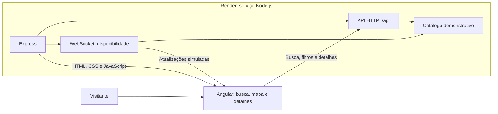

# Morada

Aplicação demonstrativa de busca de imóveis, desenvolvida com Angular e Express para estudo e portfólio.

**Demonstração online:** [Acessar a Morada](https://morada-ehurafa.onrender.com/)


> ⚠️ Este projeto está em desenvolvimento. Algumas funcionalidades ainda não estão disponíveis e podem sofrer alterações.

O serviço gratuito pode demorar a iniciar após um período sem acessos.

## Funcionalidades atuais

- Busca de imóveis por localização, finalidade e filtros
- Listagem responsiva e mapa interativo
- Detalhes do imóvel com galeria, comodidades e custos
- Formulário demonstrativo de contato
- Avisos de disponibilidade em tempo real com reconexão automática
- API Express com dados demonstrativos
- Execução como aplicação Angular ou microfrontend single-spa
- Testes automatizados, lint e formatação

Os imóveis, preços e contatos apresentados são fictícios e utilizados apenas para demonstração.

## Favoritos demonstrativos

Nos cards da busca, o botão Favoritar marca e desmarca imóveis durante a visita à página. Os favoritos são temporários: não exigem conta e desaparecem ao recarregar ou sair da página.

## Tecnologias

- Angular
- TypeScript
- SCSS
- Express
- single-spa
- Jasmine e Karma

## Como funciona



No ambiente publicado, um único serviço Node entrega o Angular, atende as requisições da API e envia os avisos de disponibilidade por WebSocket. O catálogo contém apenas imóveis fictícios.

## Executar localmente

Pré-requisitos: Node.js e npm.

```bash
npm ci
npm start
```

Acesse [http://localhost:4200](http://localhost:4200). O comando inicia o Angular na porta 4200 e a API Express na porta 3000. O proxy de desenvolvimento encaminha as requisições `/api` e a conexão WebSocket.

## Verificações

```bash
npm run test:api
npm test -- --watch=false
npm run lint
npm run format:check
npm run build
```

Os testes da interface usam o Chrome.

## Publicação no Render

O arquivo [render.yaml](render.yaml) configura um serviço Node gratuito. O build compila o Angular; depois, o Express entrega o aplicativo, a API e o WebSocket no mesmo domínio. O Render verifica a saúde do serviço em `/api/properties`.

Para criar outra instância, no painel do Render selecione **New > Blueprint**, informe a URL pública `https://github.com/ehurafa/angular-morada` e escolha a branch `main`. O Blueprint usa o `render.yaml` da raiz do repositório.

Este serviço foi conectado pela URL pública, sem integração do GitHub. Portanto, após enviar mudanças de código para `main`, abra o serviço no Render e use **Manual Deploy > Deploy latest commit**. Se alterar o `render.yaml`, use **Manual Sync** na página do Blueprint para aplicar a nova configuração.

## Disponibilidade em tempo real

Ao abrir `http://localhost:4200`, a aplicação estabelece uma conexão WebSocket
pelo caminho `/api/property-availability`. O servidor envia uma atualização
na conexão e depois a cada 10 segundos.

A atualização mais recente aparece em um aviso no canto inferior esquerdo.
Os eventos são sintéticos e não representam mudanças reais de disponibilidade.

Se a conexão for encerrada ou falhar, a aplicação tenta se reconectar após 1 segundo.
Após falhas consecutivas, o intervalo aumenta até 30 segundos. Uma atualização recebida
reinicia esse intervalo. Quando a API voltar, novas atualizações são recebidas sem
recarregar a página.

## Sugestões de localização

O campo de localização sugere bairros, ruas e estações de metrô do catálogo
demonstrativo. Ruas e estações só aparecem quando há um imóvel associado.

As sugestões são opcionais: você pode digitar qualquer lugar. Se a lista
não carregar, a busca por texto continua funcionando.

## Localização sem correspondência

Quando a localização digitada não corresponde a um imóvel elegível, a busca
mostra outras opções em São Paulo e avisa sobre essa mudança. As alternativas
continuam respeitando finalidade, tipo de imóvel, quartos e preço máximo.

Se nenhum imóvel satisfizer esses filtros, a página mostra o estado vazio
em vez de anunciar alternativas.

## Filtros na URL

Ao pesquisar, os filtros ficam registrados no endereço da página.
Você pode copiar esse endereço para compartilhar a busca ou abri-la novamente.

A localização, a finalidade, o tipo de imóvel, a quantidade mínima
de quartos e o preço máximo são restaurados ao carregar o endereço.

Os botões Voltar e Avançar do navegador recuperam as buscas anteriores.
Ao abrir um imóvel, o link “Voltar aos resultados” mantém os filtros
da busca de origem.

Valores padrão e campos vazios são omitidos da URL.
Parâmetros de filtro inválidos são tratados com valores padrão seguros.
